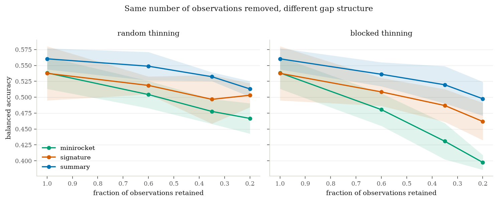

# T1 — Path signatures for irregularly sampled astronomical light curves

**Status: in progress.** Design fixed; dataset selection and implementation under way. Results are
not yet available, and no performance claim appears in this file until the code that produced it is
in `src/`.

## Overview

A photometric light curve is not a vector. It is a finite sample of a path: observations arrive at
times set by weather, scheduling and the target's position in the sky, in whichever filter the
telescope happened to be using, with per-point uncertainties that vary by an order of magnitude
across a season. Nearly every machine-learning pipeline for this data begins by destroying that
structure — interpolating onto a regular grid, binning to a fixed cadence, or fitting a Gaussian
process and resampling from it — so that a convolutional or recurrent architecture can accept the
result.

The signature transform of rough path theory accepts the raw stream directly. This track asks
whether that theoretical advantage survives contact with real photometry, and where.

## Scientific background

The signature of a path $X:[0,T]\to\mathbb{R}^d$ is the collection of its iterated integrals,

$$S(X) = \left(1,\ \int_{0<t<T} dX_t,\ \iint_{0<s<t<T} dX_s\otimes dX_t,\ \dots\right),$$

with the $k$-th term an element of $(\mathbb{R}^d)^{\otimes k}$. Three properties matter here.

**Reparameterisation invariance.** $S(X)$ is unchanged by any increasing reparameterisation of time.
The signature encodes the *order and shape* of what happened, not the clock it happened on. For data
where the observation times are set by the weather rather than by the source, this is the correct
invariance to have, and it is exactly what interpolation-based pipelines have to learn from data
instead.

**Faithfulness.** By the uniqueness theorem (Hambly and Lyons), the signature determines the path up
to tree-like equivalence — informally, up to retracing. Nothing is thrown away except the
parameterisation.

**Universality.** Linear functionals of the signature approximate continuous functions on path space
uniformly on compact sets. A linear model on signature features is therefore a universal
approximator on paths, which turns feature engineering into a question of truncation depth rather
than of architecture.

Against this: the invariance is exact for the underlying continuous path, while what is available is
a noisy, sparsely sampled version of it. Whether the guarantees have force under real survey cadence
is an empirical question, and it is the question this track exists to answer.

## Prior art, stated honestly

Path signatures have one published astronomical application: **SigNova** (Arrubarrena, Lemercier,
Nikolic, Lyons and Cass, arXiv:2402.14892, 2024), which detects radio-frequency interference in
interferometric visibility streams by scoring signature features against a clean reference set,
validated on Murchison Widefield Array and HERA data. A follow-up from the same group,
*Novelty detection on path space* (arXiv:2512.03243), develops the underlying hypothesis-testing
framework. In adjacent physical science, path signatures have been combined with graph neural
networks for slow-slip earthquake analysis (arXiv:2402.03558).

No application to photometric light curves, variable-star or transient classification, survey broker
feature sets, gravitational-wave strain, or asteroseismology was found in a targeted audit
(see [`docs/00-research-scan.md`](../../docs/00-research-scan.md), Part III). The gap is specific
and narrow, which is what makes it worth attempting: SigNova establishes that the representation
survives real radio-astronomical noise, and the open question is whether it earns its place in
time-domain photometry against a mature incumbent stack.

## The baselines this must beat

A method claiming to handle irregular sampling natively is claiming an advantage over methods that
already handle it adequately. The comparison is therefore against, at minimum:

| Baseline | What it is | Why it is the fair comparison |
|---|---|---|
| `feets` / FATS variability features | Hand-crafted statistical and periodicity features | The incumbent in survey pipelines; cheap and strong |
| Gaussian-process interpolation plus features | Fits a GP, resamples, extracts features | The standard principled treatment of irregular sampling |
| MiniRocket | Random convolutional kernels, deterministic feature map | The sharpest comparison: also a cheap fixed feature map, so the contest is structured iterated integrals against random projections at matched cost |
| Astromer / ATAT-style embeddings | Self-supervised transformer representations | The modern high-capacity option, included for context on the accuracy ceiling |

Reporting only the cases where signatures win would make the result worthless. Every baseline is
implemented and reported, including where it wins.

## The falsifiable prediction

The structure-first argument makes a specific prediction rather than a general claim of superiority:

> The signature representation should gain most where sampling is sparsest and most irregular, and
> least where light curves are dense and near-periodic. Its advantage should be largest for classes
> distinguished by the *order* of features in the light curve rather than by their marginal
> statistics, because ordering is precisely what iterated integrals encode and what order-blind
> summary statistics discard.

Both halves are testable by ablation, and both can fail. If signatures win uniformly, including on
dense periodic data, the explanation is probably not the one claimed and the result needs a
different account.

## Data

Two samples, chosen to test opposite halves of the prediction below. Access recipes, with the live
test results and the one failure encountered, are in
[`docs/02-data-sources.md`](../../docs/02-data-sources.md).

**Primary — ZTF Bright Transient Survey.** 12,916 spectroscopically classified transients (SN Ia
7,894, SN II 1,736, CV 685, AGN 404, and a tail of rarer types), with per-epoch $(t, m, \sigma,
\text{band})$ photometry in $g$ and $r$ served by the ALeRCE broker without authentication. Sampling
is set by weather and survey scheduling; light curves are short and sparse. Spectroscopic labels are
the ground truth, kept strictly separate from ALeRCE's own machine classifications.

**Counter-test — Gaia DR3 epoch photometry.** 9,976,881 sources with official variability
classifications, three bands ($G$, $BP$, $RP$) sampled at genuinely different instants within each
transit, at roughly 6 kB per source. Periodic variables, where period is the physically meaningful
quantity.

The second sample is not a robustness check. It is the case the method should handle *badly*, and
measuring how badly is the point.

## Signature implementation

`src/signature.py` implements truncated signatures from scratch: each straight segment contributes
the tensor exponential of its increment, and segments combine by Chen's identity. It is written
rather than imported because the theory track needs access to individual tensor levels, and because
the standard C++ backends do not install reliably across current Python versions — `iisignature`
fails to build on Python 3.12.

Correctness is verified by `src/verify_signature.py`, which checks agreement with three independent
libraries — `esig`, `signax`, and `roughpy` (the last from the group behind SigNova) — and four
structural identities: reparameterisation invariance, level 1 equalling the total increment, the
shuffle identity $S_1 S_2 = S_{12} + S_{21}$, and the vanishing of the signature of a path
concatenated with its own reversal. All sixteen checks pass, with agreement at the $10^{-13}$ level.

```bash
python3 src/verify_signature.py    # 16/16 checks
```

## Planned method

1. **Ingest** raw per-epoch photometry as $(t,\,m,\,\sigma,\,\text{band})$ tuples, with quality flags
   applied and no interpolation, binning or resampling at any stage of the signature path.
2. **Path construction.** Build the multi-band path, comparing basepoint, time-augmented and lead-lag
   augmentations. The lead-lag transform is what makes quadratic variation visible to the signature,
   which matters for stochastically variable sources.
3. **Signature features** at truncation depths 1 to 4, using log-signatures where the dimension
   demands it.
4. **Classification** with a deliberately simple linear model and a gradient-boosted tree, so that
   the representation rather than the classifier is on trial.
5. **Ablation over sampling.** Degrade the cadence systematically — random thinning against
   structured, survey-realistic gap patterns at matched density — and measure how each method
   degrades. This ablation, not the headline score, is the actual result.
6. **Uncertainty handling.** Photometric errors have no natural place in the signature construction.
   Options to be tested include error-weighted path construction and Monte Carlo perturbation of the
   input path. This is a genuine weakness of the approach and is treated as such.

## Results so far

All numbers are balanced accuracy under 5-fold stratified cross-validation with
gradient-boosted trees, on 2,375 objects in 8 classes. Chance is 0.125.

### The mechanism works, but not where predicted

`src/order_sensitivity.py` builds two classes of synthetic double-peaked light curve that
differ only in which peak comes first: identical marginal magnitude distributions,
identical net change, opposite ordering.

| Representation | Balanced accuracy |
|---|---|
| Order-blind summary features | 0.512 |
| Signature depth 1 | 0.524 |
| Signature depth 2 | 0.489 |
| Signature depth 3 | **0.978** |
| Signature depth 4 | 0.990 |

The prediction written down in advance was that separation would appear at depth 2, since
the Lévy area is the classical order-sensitive term. It does not. With channels
$(t, m)$ the time coordinate is strictly increasing, so the antisymmetric part of level 2
reduces to $\int m\,\mathrm{d}t$ once the boundary terms vanish — the area under the light
curve, which is the same whichever peak came first. A path monotone in one coordinate
encloses no signed area that ordering can change. Ordering first becomes visible at level
3. Truncating at depth 2 to economise would have discarded exactly the information the
method exists to provide.

### On real photometry, the baseline still wins

| Representation | Features | Balanced accuracy |
|---|---|---|
| summary + signature (lead-lag, depth 4) | 729 | **0.578** |
| summary (hand-crafted) | 49 | 0.560 |
| signature, per-band, raw time, lead-lag, depth 4 | 680 | 0.548 |
| MiniRocket (interpolated grid) | 9,996 | 0.538 |
| signature, per-band, raw time, depth 4 | 60 | 0.524 |
| signature, per-band, unit time, depth 4 | 60 | 0.455 |

Read in order, the ablation says three things.

**Preprocessing mattered more than the representation.** Scaling time to $[0,1]$ costs
0.069 — it discards the duration of the event, which the hand-crafted baseline keeps as
`t_span`. The first version of this pipeline did exactly that and would have reported a
much worse result as a property of signatures rather than of the preprocessing.

**The lead-lag transform is worth a further 0.025**, taking signatures past MiniRocket. It
exposes quadratic variation, and roughly a third of the sample (AGN and CV) are
stochastically variable rather than transient, so this is the expected direction.

**Absolute brightness cannot enter through the channel preparation.** The `raw` and
`raw_time` preparations score identically to four decimal places, which is not a
coincidence: the signature depends only on increments, so a constant magnitude offset
cannot change it. Adding a basepoint is the only route, and it makes the result worse
(0.512 against 0.548), so the absolute level is not being used productively.

The honest summary is that signatures alone lose to a 49-feature hand-crafted baseline that
has absorbed two decades of domain knowledge, while using fourteen times as many features.

### The complementarity result, tested properly

A gain of 0.018 against a fold spread of 0.022 establishes nothing on its own, so it was
given its own test: 50 paired folds on identical splits (5-fold repeated ten times), a
Wilcoxon signed-rank test, a bootstrap interval, and — the part that decides it — a control
in which the signature block is replaced by Gaussian noise of identical shape and column
variance.

| Feature block | Balanced accuracy |
|---|---|
| summary + signature | **0.5769 ± 0.0200** |
| summary | 0.5623 ± 0.0167 |
| signature alone | 0.5473 ± 0.0218 |
| summary + matched noise | 0.5278 ± 0.0146 |

| Comparison against summary alone | Difference | 95% CI | Folds improved |
|---|---|---|---|
| + signature | **+0.0147** | [+0.0078, +0.0212] | 38 / 50 |
| + matched noise | **−0.0345** | [−0.0396, −0.0297] | 1 / 50 |

The noise control is what makes this readable. A gradient-boosted ensemble handed 680 extra
candidate splits could improve for reasons having nothing to do with their contents — and
the control shows it does not: 680 columns of noise *cost* 0.0345. The same number of
signature columns *gain* 0.0147. The two differ by about 0.049, and the direction of the
control rules out capacity as the explanation.

**A caveat that belongs next to the p-value.** Repeated cross-validation folds are not
independent — they reuse the same 2,375 objects — so the Wilcoxon p (9.5 × 10⁻⁵) and the
bootstrap interval are optimistic as formal inference. The comparison that does not depend
on that assumption is the one against the noise control, since both blocks face identical
folds and identical dependence, and they land on opposite sides of zero.

**What this means for the prediction.** The design predicted that signatures should gain
where sampling is irregular. Taken alone they do not beat the incumbent. But they carry
information the incumbent does not have, and that is a weaker and more interesting claim
than the one originally made: not a better representation, a *different* one.

### The sampling ablation — the actual experiment

Light curves were thinned to a fixed retained fraction under two regimes that remove the
*same number* of observations but destroy different structure: **random** thinning (each
observation dropped independently, gaps short and scattered) and **blocked** thinning
(contiguous runs removed, imitating weather outages and seasonal windows).

| | random 1.00 | 0.60 | 0.35 | 0.20 | blocked 0.60 | 0.35 | 0.20 |
|---|---|---|---|---|---|---|---|
| summary | 0.560 | 0.549 | 0.532 | 0.513 | 0.536 | 0.520 | 0.498 |
| signature | 0.538 | 0.519 | 0.497 | 0.503 | 0.508 | 0.487 | 0.462 |
| MiniRocket | 0.538 | 0.504 | 0.478 | 0.467 | 0.481 | 0.431 | **0.398** |

The comparison that matters is the difference between the two regimes at matched density —
the cost of gap *structure* with gap *count* held fixed:

| Retained | summary | signature | MiniRocket |
|---|---|---|---|
| 0.60 | −0.013 | **−0.010** | −0.024 |
| 0.35 | −0.013 | **−0.010** | −0.047 |
| 0.20 | **−0.016** | −0.041 | −0.069 |

**Confirmed: gap structure matters, not merely gap count, and it costs the
interpolation-dependent method the most.** MiniRocket — which requires a regular grid and
is given one — pays two to four times the penalty of the other two at every density. At 20%
retention it loses 0.069 to structured gaps alone, dropping to 0.398 where the hand-crafted
features hold 0.498. This is the clearest evidence in the whole track for the premise that
resampling irregular data onto a grid throws something away, and it is a prediction that
could have failed: had both regimes produced the same curves, the motivation would have
collapsed.

At moderate thinning the signature is the *least* damaged by gap structure (−0.010 against
the baseline's −0.013), which is the direction the reparameterisation argument predicts.

**Not confirmed: signatures do not close the gap as data thins.** The prediction was that
they should gain most where sampling is sparsest. The difference between the baseline and
the signature under random thinning goes 0.023 → 0.030 → 0.036 → 0.010 as the retained
fraction falls from 1.00 to 0.20 — it widens through the middle of the range before
narrowing at the extreme, rather than shrinking monotonically. And at the sparsest setting
the signature's own structured-gap penalty jumps to −0.041, worse than the baseline's
−0.016. Below roughly a dozen observations per object the path is too coarsely sampled for
the iterated integrals to be estimated stably, and the invariance argument stops paying.

The honest reading: the *mechanism* the track was built on is real and measurable, and it
favours signatures against grid-based methods. It does not favour them against good
hand-crafted features, which remain the strongest single representation at every sampling
density tested.



### The Gaia counter-test — where signatures should lose, and do

The counter-test was designed at the same time as the main experiment and run afterwards on
2,999 Gaia DR3 periodic variables in six classes (CEP, DSCT|GDOR|SXPHE, ECL, LPV, RR, RS;
median 130 observations over 960 days). Its logic: ZTF transients are separated by the shape
and ordering of the light curve, which signatures encode; Gaia periodic variables are
separated by **period**, which is a statement about the clock — and the signature is
invariant to reparameterisation of the clock.

Every figure below is on the full sample. An earlier 300-object pilot overstated the central
gap by more than a factor of two (0.163 against 0.074), which is why pilot numbers were
labelled as such and never carried into a claim.

| Measurement | Gaia (2,999) | ZTF (2,375) |
|---|---|---|
| Baseline minus best signature | **+0.0743** | +0.0123 |
| Value of keeping duration (raw vs unit time) | +0.0387 | **+0.0688** |
| Value of the lead-lag transform | **+0.1130** | +0.0246 |
| Complementarity: signature added to baseline | **−0.0000** | **+0.0147** |
| Matched-noise control | −0.0016 | −0.0345 |

**Prediction P1 confirmed.** Signatures lose six times harder on periodic variables than on
transients. A label-shuffled control sits at 0.160 (chance is 0.167), so the comparison is
not an artefact of the evaluation.

**Prediction P2 refuted.** Restoring duration was expected to matter *more* on Gaia. It
matters *less* (+0.039 against +0.069, and +0.018 against +0.065 averaged over all
depth/augmentation pairs). The reason is measurable: Gaia's observing baseline is set by the
mission rather than by the object, so span carries almost no information (coefficient of
variation 0.039 against ZTF's 1.250). **Duration is not period.** The time channel restores
how long the observation lasted; it does not restore the clock the variability lives on, and
that distinction is exactly what the counter-test was built to expose.

**The sharpest result: one feature beats a thousand.** Restricted to the 1,806 objects with
a catalogued period:

| Arm | Features | Balanced accuracy |
|---|---|---|
| **period only** | **1** | **0.7726 ± 0.0925** |
| signature, per-band, raw time, lead-lag, depth 4 | 1,020 | 0.7412 ± 0.0128 |
| summary (hand-crafted) | 72 | 0.9850 ± 0.0069 |
| summary + period | 73 | **0.9990 ± 0.0013** |

A single number outperforms a 1,020-coefficient signature representation by 0.031. That is
not a statistical trend about which method is better; it is a structural fact about what
these classes are separated by, and it is precisely the quantity reparameterisation
invariance discards.

*Caveat, and it is not neutral.* The period requirement retains classes very unevenly: ECL
100%, CEP 98%, RR 98%, but LPV 45%, DSCT-group 19% and RS just 1.2%. Objects without a
catalogued period are largely those for which a period is hard to define, so this arm speaks
about the periodic classes and not about the sample as a whole.

**And complementarity vanishes.** On ZTF, signatures added +0.0147 to the baseline against a
noise control of −0.0345 — the result that made T1 worth reporting. On Gaia the same test
returns −0.0000. Where the baseline already reaches 0.985, signatures contribute nothing.

Read together with the main experiment, this closes the track symmetrically. Signatures
carry information hand-crafted features lack **when classes differ by the shape and ordering
of an irregularly sampled curve**, and carry nothing when classes differ by a period the
representation is built to ignore. The same property explains both the win and the loss.

### Sampling structure

The gap distribution is bimodal: a cluster near $10^{-3}$ days from repeated exposures
within a single night, the main survey cadence at 1 to 10 days, and a tail at 100 to 1,000
days from seasonal visibility windows. Four orders of magnitude, which is what makes this a
reasonable test bed. It also illustrates the invariance concretely — repeated exposures on
the same night occupy almost no arc length, so they barely move the signature, whereas a
fixed-grid method counts them with the same weight as any other sample.

## Risks recorded in advance

- **The baselines may simply win.** `feets` features and MiniRocket are strong, and the incumbent
  stack has absorbed a great deal of domain knowledge. A null result is a real possibility and would
  be reported as the headline.
- **Truncation may erase the theoretical advantage.** Universality is a statement about the full
  signature; at depth 3 or 4 the representation may amount to a set of quadratic and cubic
  statistics with no advantage over cheaper equivalents. T3 exists to measure this.
- **Multi-band paths are ill-posed.** Observations in different filters are not simultaneous, so
  building a single multi-dimensional path requires a choice about how to combine channels that
  were never sampled together. Different choices may dominate the result.
- **Reparameterisation invariance may be actively harmful.** Period is physically meaningful for
  variable stars, and a representation invariant to time reparameterisation discards it unless time
  is explicitly re-introduced as a channel. Where the invariance is wrong, it must be broken
  deliberately, and that decision must be reported rather than buried in a preprocessing step.

## References

1. Chevyrev, I. and Kormilitzin, A. (2016). *A Primer on the Signature Method in Machine Learning.* arXiv:1603.03788
2. Hambly, B. and Lyons, T. (2010). *Uniqueness for the signature of a path of bounded variation and the reduced path group.* Annals of Mathematics 171, 109.
3. Arrubarrena, P., Lemercier, M., Nikolic, B., Lyons, T. and Cass, T. (2024). *Novelty Detection on Radio Astronomy Data using Signatures.* arXiv:2402.14892
4. Dempster, A., Schmidt, D. F. and Webb, G. I. (2021). *MiniRocket: A Very Fast (Almost) Deterministic Transform for Time Series Classification.* arXiv:2012.08791
